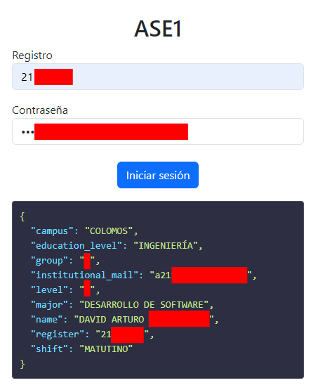

# ASE1 ENDPOINT

Este repositorio contiene un servidor Flask que permite a los usuarios iniciar sesión en la plataforma "Ceti". Realiza una solicitud a la API de "ase1" y devuelve la información del usuario en formato JSON.



## Índice

- [Características](#características)
- [Requisitos](#requisitos)
- [Instalación](#instalación)
- [Uso](#uso)
- [Funcionamiento de la Solicitud](#funcionamiento-de-la-solicitud)
- [Contribuciones](#contribuciones)
- [Licencia](#licencia)

## Características

- Iniciar sesión en la plataforma "Ceti".
- Retornar datos del usuario en formato JSON.
- Manejo de errores y mensajes claros para el usuario.

## Instalación

1. Clona este repositorio:
   ```bash
   git clone https://github.com/DavidAr55/ase1-endpoint.git
   cd ase1-endpoint
   ```

2. Crea un entorno virtual:
   ```bash
   python -m venv env
   source env/bin/activate   # En Windows usa `env\Scripts\activate`
   ```

3. Instala las dependencias:
   ```bash
   pip install -r requirements.txt
   ```

4. Crea un archivo `.env` en la raíz del proyecto con las siguientes variables:
   ```env
   APP_URL=http://localhost:5000
   EXTERNAL_URL=url-de-tu-aplicación-externa

   CETI_AUTH_URL=https://ase1.ceti.mx/tecnologo/seguridad/iniciarsesion
   CETI_SCHEDULE_URL=https://ase1.ceti.mx/tecnologo/tgoalumno/horario
   ```

## Uso

Para ejecutar el servidor, usa el siguiente comando:

```bash
python app.py
```

El servidor se ejecutará en `http://127.0.0.1:5000`. Puedes acceder a la interfaz en tu navegador.

## Funcionamiento de la Solicitud

1. El usuario ingresa su registro y contraseña en el formulario.
2. Al enviar el formulario, el servidor envía una solicitud POST a la URL de autenticación de "Ceti".
3. Si la autenticación es exitosa, se realiza otra solicitud para obtener la información del horario del usuario.
4. Los datos se extraen y se devuelven en formato JSON.

### Ejemplo de JSON de respuesta

```json
{
    "campus": "COLOMOS",
    "major": "DESARROLLO DE SOFTWARE",
    "group": "*",
    "institutional_mail": "a21**************",
    "level": "*",
    "education_level": "INGENIERÍA",
    "name": "DAVID ARTURO ************",
    "register": "21********",
    "shift": "MATUTINO"
}
```

## Contribuciones

Las contribuciones son bienvenidas. Si deseas colaborar, por favor abre un issue o envía un pull request.